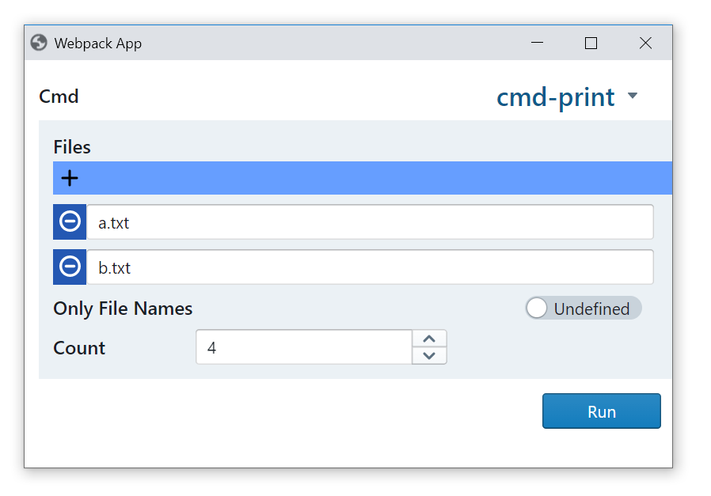

# A CLI Library for NodeJS/TypeScript

[](https://twitter.com/intent/follow?screen_name=hediet_dev)

Not production ready, but working towards it. Until then, it can safely be used for hobby projects.
Uses semantic versioning.

# Features

-   **Unopinionated** - Does not enforce some folder structure or other architecture decisions.
-   Supports single-file multi-command applications.
-   Works with `ts-node` or plain compiled files using `tsc`.
-   **Lightweight** - Only has a small API surface and no feature bloat.
-   **Fully typed** - Every parameter has a static type arguments are validated against.
-   **Fully reflective** - A help text is generated automatically.
-   **Embedded GUI** - Use `--cli::gui` to launch an html based GUI which assists with specifying arguments.

# Deficits

-   No nicely formatted help yet
-   No tests yet
-   API not final

# Installation

Use the following command to install the library using yarn:

```
yarn add @hediet/cli
```

# Usage

This example demonstrates most of the API:

```ts
import {
	types,
	runDefaultCli,
	cliInfoFromPackageJson,
	namedParam,
	positionalParam,
	createDefaultCli,
} from "@hediet/cli";
import { join } from "path";

// An arbitrary type.
interface CmdData {
	run(): Promise<void>;
}

const cli = createDefaultCli<CmdData>()
	// Defines a command with name `print`
	.addCmd({
		name: "print",
		description: "Prints selected files.",
		// In `open --mode=read-only foo.txt`, `foo.txt` would be a positional argument.
		positionalParams: [
			positionalParam("files", types.arrayOf(types.string), {
				description: "The files to print.",
			}),
		],
		// In `open --mode read-only`, `read-only` would be a named argument,
		// if `mode` is a parameter that accepts at least one argument.
		// Otherwise, `read-only` would be a positional argument.
		namedParams: {
			onlyFileNames: namedParam(types.booleanFlag, {
				// use either `--onlyFileNames` or `-n`
				shortName: "n",
				description: "Only print filenames",
			}),
			count: namedParam(types.int, {
				description: "The count",
			}),
		},
		// `args` is fully typed.
		getData: args => ({
			// Synchronously return an instance of `CmdData` here.
			async run() {
				for (const f of args.files) {
					if (args.onlyFileNames) {
						console.log(f);
					} else {
						console.log(f + " content");
					}
				}
			},
		}),
	});

// Processes command line arguments
// and invokes the handler with data obtained from `getData` of the selected command.
// Also processes `--help`, `--version` and other global flags.
runDefaultCli({
	info: cliInfoFromPackageJson(join(__dirname, "./package.json")),
	cli,
	// Asynchronously process an instance of `CmdData` here as you like.
	dataHandler: data => data.run(),
});
```

# CLI Syntax

The parser accepts the following EBNF for a single part (`PART`):

```
PART ::= ("--"|"/") PARAM_NAME ("=" VALUE)?
			| "-" SHORT_PARAM_NAME ("=" VALUE)?
			| "-" SHORT_PARAM_NAME+
			| POSITIONAL_SEPERATOR
			| VALUE

POSITIONAL_SEPERATOR ::= "--"
SHORT_PARAM_NAME ::= [a-zA-Z_:]
PARAM_NAME ::= SHORT_PARAM_NAME [a-zA-Z_:0-9-]*
VALUE ::= .*
```

Parts are splitted by the underlying shell.

A single `POSITIONAL_SEPERATOR` is used to treat all following parts as value.

`-abc` is the same as `-a -b -c`. To avoid confusion, grouped parameters must not accept values.

# GUI

This library uses my highly experimental libraries [@hediet/semantic-json](https://github.com/hediet/semantic-json) and
[@hediet/semantic-json-react](https://github.com/hediet/semantic-json-react) which should not be used on their own right now. They have an incredible potential though, as this application demonstrates.

For the example above, the generated UI looks like this:



The UI can be launched with `ts-node ./demo --cli::gui`.
If chrome is installed, a window is automatically opened, otherwise an URL will be shown that
can be opened in any browser.

Advanced UI features (like browsing/autcompletion for files) are planned as part of advancements in `@hediet/semantic-json-react`.

# Comparison

-   [oclif](https://github.com/oclif/oclif)

    -   Enforces a certain folder structure for multi command applications.
    -   Not easy to integrate into existing code.
    -   oclif is an entire framework, `@hediet/cli` only a library.
    -   No GUI support.

-   [clime](https://github.com/vilic/clime)

    -   Enforces a certain folder structure for multi command applications.
    -   Limited type inference due to use of decorators.
    -   No GUI support.

-   [@microsoft/ts-command-line](https://github.com/microsoft/rushstack/tree/master/libraries/ts-command-line)
    -   Weird design
        -   What is `onDefineParameters` for?
        -   What happens if `defineFlagParameter` is used on construction?
    -   Parameters must be declared multiple times.
    -   No GUI support.

# Architecture

`@hediet/cli-lib` is meant to be isomorphic so it also works in the browser,
whereas `@hediet/cli` is only meant for NodeJs.

## Internal Data Flow

Primary goal of this library is to process the command line arguments passed to the current process.

The user writes the command line arguments as a single string in a shell of his choice:

```sh
foo bar --baz qux quux /x=y
```

This string is splitted by his shell and then passed as an array of strings to the launched process (`foo`):

```json
["bar", "--baz", "qux", "quux", "/x=y"]
```

The original process cannot reconstruct the original command line argument string as whitespaces are lost.

### [Parser](../cli-lib/src/parser.ts)

This string array is parsed by the `Parser` class.
Each array item is classified as value or as parameter that might have a value:

```ts
[
	Value("bar"),
	Param("baz"),
	Value("qux"),
	Value("quux"),
	ParamWithValue("x", "y"),
];
```

This information is stored in `ParsedCmd` instances.

### [Assembler](../cli-lib/src/assembler.ts)

`ParsedCmd`s are transformed into an `AssembledCmd` by the `CmdAssembler` class.
The assembler needs to know how many arguments a parameter can accept (`NoValue`, `SingleValue` or `MultiValue`).
Depending on that, parts are assembled together into positional and named arguments.

If `baz` and `x` are `SingleValue`-parameters, the result would be:

```ts
[
	PositionalArg("bar"),
	NamedArg("baz", ["qux"]),
	PositionalArg("quux"),
	NamedArg("x", ["y"]),
];
```

### [Cmd](../cli-lib/src/cmd.ts)

A `Cmd` defines typed parameters and can transform a `ParsedCmd`
into user defined data by using the `Assembler` and [type parsers](../cli-lib/src/param-types.ts).

### [Cli](../cli-lib/src/cli.ts)

These commands are organized in instances of the `Cli` class.
Given a string array, it detects the specified command and asks the command to get the user defined data.

### [runDefaultCli](./src/runDefaultCli.ts)

This function takes a `Cli` instance and executes a data handler, prints a help, the version or launches a GUI,
depending on the current command line args.

# TODOs

See open issues on github. Feel free to contribute and ask questions! ;)
